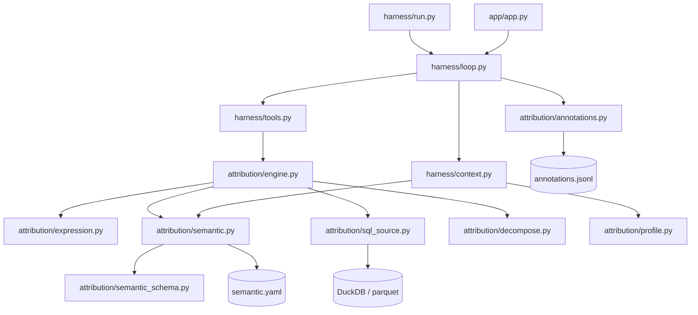
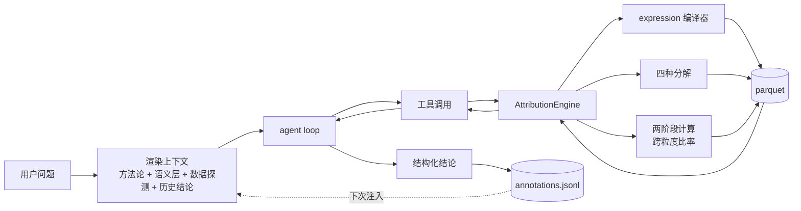

# 归因引擎复用化改造设计

> 状态：设计稿，待确认（未动任何代码）
> 日期：2026-09-13
> 关联：`docs/ATTRIBUTION_CONTRACT.md` · `semantic/semantic.yaml` · `docs/DATA_SCHEMA.md` · `docs/report_报告1.md`

## 0. 要解决的问题

**换一套数据，现在必须改 Python 代码；换一个分析场景，语义层根本表达不了。**

本文回答四件事：

1. 耦合点在哪、怎么拆（复用性，§1–§3）
2. 现有数据上如何把分析做深（分析能力，§4）
3. 需要哪几套数据、怎么造、与真实数据差多远（数据集，§5）
4. 分析语义从哪来、怎么越用越厚（语义收集，§6）

**贯穿全文的三条原则：**

- **快速验证 = 缩小实现范围，不是缩小设计视野。** 每个里程碑范围小、可独立验证，但语义层 schema 必须按「四套数据集的并集需求」一次设计到位，否则每加一套数据就要返工三轮。
- **结构严谨 = 每个里程碑自带验证命令 + 数据可复现 + 评估可自动评分。** 不留临时 hack。
- **语义层是地图，不是配置文件。** 它定义了下钻归因的可达空间（§3.6），**场景内固定、场景间可变**，
  因而必须被治理：版本、变更分级、可达性校验、机械防回退。

## 1. 诊断

### 1.1 契约与实现已经漂移（根因）

`ATTRIBUTION_CONTRACT.md`「实现要点」第 1 条要求：

> additive 指标按 `expression` 里的 `SUM(...)`/`COUNT(DISTINCT ...)` 生成 DuckDB SQL；
> derived 指标先查其 `depends_on` 的底层指标再相除。

实现绕过了这条：`attribution/engine.py:21-38` 用 `_ADDITIVE_SQL` / `_DERIVED_SQL`
两个 Python dict 写死了全部指标口径，YAML 里的 `expression` 与 `depends_on`
**从未被引擎读取**，只用于展示（`verify_data.py:135`、`app.py:442`、`tools.py:101`）。

后果比「要改代码」更隐蔽：**存在双份定义**。改 YAML 以为改了口径，实际没生效；
而且 `get_semantic_overview` 把 `expression` 展示给模型，模型据此理解口径、
引擎按另一套执行——两者一旦不一致，模型的分析建立在错误前提上。

### 1.2 硬编码清单（换数据集要改哪里）

| 位置 | 写死了什么 | 换数据集的后果 |
|---|---|---|
| `engine.py:93-98` | 必须存在 6 个指标名 + 4 个维度名 | 构造引擎即抛 `ValueError` |
| `engine.py:21-38` | `_ADDITIVE_SQL` / `_DERIVED_SQL` | 加/改指标 = 改 Python |
| `engine.py:41-45` | `_NAME_COL`（store→store_name 等） | 维度表 name 列名变了 = 改 Python |
| `tools.py:54` | `Literal["store","product","channel","date"]` | 新维度进不了工具 schema，**模型看不见** |
| `tools.py:39` | docstring 里的指标清单 | 模型读到的工具说明失真 |
| `loop.py:34-60` | 「电商分析师」话术 + `:51` 日期范围 2024-09~2026-08 | 提示词误导模型 |
| `run.py:15-16` | 数据/语义路径是模块常量 | 无法切换数据集 |
| `self_test.py:52` | 断言「上海徐家汇旗舰店」 | 唯一的验证入口随数据失效 |

**可以复用、必须保留的部分**：`_needed_joins` 的 join 推导、`contribute` 的双窗
FULL JOIN 配对、`_slice_frame` 的合并去重、additive/derived 分流。这些是数据集无关的引擎骨架。

### 1.3 语义层的表达力缺口（**静默错误**）

比硬编码更危险的一类问题：**引擎假设所有指标都能在任意维度上 `SUM`**，但真实业务里存在半可加指标。

**MRR 可以跨客户求和，不能跨时间求和。** 3 月 MRR + 4 月 MRR 没有意义，应取期末值。
同理：DAU、账户余额、库存、活跃用户数。

```python
query_metric('mrr', [], {}, '2026-01-01', '2026-03-31')
# 现在返回：1月+2月+3月 MRR  ← 3 倍，完全错误
# 正确应为：3 月末的 MRR
```

**它不报错，它给一个错的数。** 静默错误比崩溃难查得多，而它只有引入快照型指标时才会暴露——
零售数据集（GMV/销量/订单数都是真可加）永远发现不了。

其余缺口（均由 §5 的数据集逼出）：

| 需要表达 | 谁逼出来的 | 现语义层 | 不支持会怎样 |
|---|---|---|---|
| **半可加指标**（时间聚合语义） | saas-mrr、user-journey | ✗ 完全没有 | 对 MRR 做时间求和 → **静默错误** |
| **同期群维度**（从行为派生，非维度表字段） | user-journey | ✗ | 留存分析无法表达 |
| **跨粒度比率**（分子分母不同人群） | user-journey | ✗ | 转化率/留存率/ARPU 算不出来 |
| **分解类型分型**（乘法/加法/比率/结构） | 四套全要 | ✗ | MRR waterfall（加法型）无法表达 |
| **多事实表** | marketing-funnel | ✗（单 `fact_table`） | 平台表与订单表无法并存 |
| 维度类型区分（表 / 派生） | user-journey | ✗ | — |

### 1.4 契约：管「地图必须画成什么样」，不管「地图上有什么」

现状的 `ATTRIBUTION_CONTRACT.md` 把两类话冻在了一起：

| 类型 | 例子 | 换个数据集还成立吗 |
|---|---|---|
| **引擎设计** | 「contribute 返回的 top 里，每个切片必须有 `key` 字段」 | ✅ 成立 |
| **数据描述** | 「指标名必须是 gmv/sales_qty/...」「name 列是 store_name/sku_name」 | ❌ 只对这套数据成立 |

`engine.py:93-98` 的硬校验正是在执行第二类——这就是换数据集就崩的直接原因。

**同一份信息目前有三处拷贝**：「指标是 gmv/sales_qty/...」同时存在于
`ATTRIBUTION_CONTRACT.md:150`（文字）、`semantic/semantic.yaml:15-45`（数据）、
`engine.py:93-98`（代码）。改一处另两处不会跟着变——§1.1 说的「双份定义」实际是三份。

**拆分标准：这句话换个数据集还成立吗？**

| 部分 | 处理 |
|---|---|
| 方法签名、返回结构、`key`/`label` 规则、纯 dict 约束 | **保留**，升级为 v2（只增不改，新增 `decompose`） |
| **语义层 schema 规范**：必须能声明 metrics（expression/type/time_aggregation）与 dimensions（table/key/hierarchy），引擎必须校验自洽性 | **保留**——这是对地图的**能力要求** |
| 具体词汇表实例（6 指标 / 4 维度 / name 列 / 日期格式） | **删除**——由 `semantic.yaml` 唯一承载，并纳入 §3.6 治理 |

**「冻结」的理由已经消失。** 契约开头写「子 agent B(归因引擎)与 harness 主线之间的合同……双方都不得改」——
冻结是为了两个 subagent 并行开发时先钉死接口。并行开发早已结束，
所以问题不是「能不能动」，而是「今后还要不要冻结、为了什么」。

## 2. 目标架构

### 2.1 目录结构

```
bi-attribution-agent/
├── datasets/                        # 数据集包：换数据 = 换目录
│   ├── ecommerce-demo/              # 零售星型（现有，扩到 6 个 case）
│   ├── marketing-funnel/            # 广告投放 + 埋点 + 订单（14 个 case）
│   ├── user-journey/                # 用户事件流 + 同期群（6 个 case）
│   └── saas-mrr/                    # 订阅制（4 个 case）
│       ├── dataset.yaml             # 元信息 + version（评估结果绑定它）
│       ├── semantic.yaml            # 语义层
│       ├── ground_truth.yaml        # 埋点真值（造数时写入）
│       ├── cases/*.yaml             # 评估用例
│       ├── expectations.yaml        # 数据集专属黄金断言
│       ├── annotations.jsonl        # 归因结论沉淀
│       └── data/*.parquet
├── attribution/
│   ├── engine.py                    # 归因算法：query / contribute / detect（**不认 DuckDB**）
│   ├── sql_source.py                # 数据访问层（Repository）：SQL 构建 + DuckDB 执行
│   ├── expression.py                # 表达式编译器（YAML → DuckDB SQL）
│   ├── semantic.py                  # 语义层服务：加载 / 访问 / 编译缓存 / 可达性
│   ├── semantic_schema.py           # 地图的定义与自证：YAML 解析 + §3.5 规则
│   ├── semantic_diff.py             # 两版地图对比：契约 + 输入归一化（§3.6③）
│   ├── semantic_diff_rules.py       # 变更级别判定表（纯规则，无 IO）
│   ├── decompose.py                 # LMDI 乘法/加法/比率/结构分解（§4）
│   ├── profile.py                   # 数据探测（含半可加识别）
│   └── annotations.py               # 结论沉淀读写
├── harness/
│   ├── datasets.py                  # 数据集包发现与解析（§3.3）
│   ├── loop.py                      # agent 循环（提示词改为现场渲染）
│   ├── context.py                   # 方法论（常量）+ 数据集上下文（渲染）
│   ├── tools.py                     # 工具 schema 由语义层动态生成
│   └── run.py                       # 入口：--dataset / --data-dir / --semantic / --list-datasets
├── app/
│   ├── app.py                       # Streamlit 主程序（数据集选择器 + 对话）
│   └── semantic_view.py             # 语义层只读视图（指标/维度/分解/日历/陷阱）
├── scripts/
│   ├── profile_data.py              # 生成语义层草稿（含半可加识别）
│   ├── check_semantic.py            # 语义层校验 + 两版 diff（§3.6③，CI 硬闸门）
│   ├── verify_dataset.py            # 跑黄金断言 + 回验埋点
│   ├── evaluate_agent.py            # 跑 case 集，出准确率报告
│   └── generate_data.py             # 造数（按数据集拆分）
└── tests/                           # pytest：契约测试 + 机械防回退（§3.6⑤）
```

### 2.2 模块职责

| 模块 | 职责 | 边界 |
|---|---|---|
| `expression.py` | 把 `SUM(amount)`、`gmv / NULLIF(orders_count,0)` 编译成 DuckDB SQL | 纯函数，不碰数据、不碰 IO |
| `semantic_schema.py` | 地图的**定义与自证**：YAML → `Metric`/`Dimension` 的 fail-fast 构造、词汇与常量、§3.5 声明规则 | **零反向依赖**（不 import 任何 `attribution.*`，不碰 DuckDB） |
| `semantic.py` | 语义层**服务**：加载、访问、编译缓存、§3.5 引用一致性、§3.6④ 可达性 | 不生成 SQL；需要「地图之外的事实」（列信息、编译结果）的规则留在这里 |
| `semantic_diff.py` | 两版地图对比：契约 + 输入归一化 + 编排（§3.6③） | 只依赖 `semantic_schema`，不认得 `Semantic` 内部 |
| `semantic_diff_rules.py` | **变更级别判定表**（§3.6②），纯函数 | 无 IO、不认识 `Semantic`；导入期自检字段是否都已登记级别 |
| `harness/datasets.py` | 数据集包的发现与解析 | 不加载语义层、不碰 DuckDB、不碰 LLM |
| `sql_source.py` | 数据访问层：列探测、SQL 构建与执行，只返回原生数值 | 不认得口径、贡献度、展示逻辑 |
| `decompose.py` | 四种分解（乘法/加法/比率/结构） | 纯函数，输入数值序列，输出效应字典 |
| `engine.py` | 归因算法（下钻、贡献度、异常检测、分解入口） | 只依赖 `semantic` + `sql_source` + `decompose`；**不认识 DuckDB**，也不认识具体数据集 |
| `context.py` | 把语义层 + 数据探测渲染成给模型的上下文 | 只产出文本，不调用模型 |
| `tools.py` | 工具包装 + 动态 schema | 不包含业务口径，不重复渲染 `render_overview()` |

> 分层判据可机械检验：`engine.py` 里不得出现 `import duckdb`（数据访问是否搬干净），
> `semantic_schema.py` 里不得出现任何 `attribution.*` import（是否真的零反向依赖）。

### 2.3 依赖图



无环：`engine` 不认识 `harness`，`expression` / `decompose` 不认识 `engine`，`context` 不认识 `engine`。

### 2.4 数据流



## 3. 关键设计（基础设施）

### 3.1 expression 编译器

输入是 YAML 里的 `expression` 字符串，输出可内联进 SQL 的聚合表达式。

- **符号表**：① 指标名 → 递归展开；② 事实表列名 → `<alias>.<col>`，列名由 DuckDB `DESCRIBE` 运行时探测
- **展开顺序**：先替换指标名（长名优先，避免 `gmv` 误伤 `gmv_per_user`），再替换列名
- **除零**：约定表达式里显式写 `NULLIF(分母, 0)`——保持「SQL 风格」，不发明 DSL
- **Fail fast**：编译在引擎构造时完成，语法/引用错误立刻抛错

**边界（v1 内联展开的能力上限）**：要求分子分母**同粒度、同事实表**。
跨粒度比率（转化率/留存率/ARPU）走 §3.2 的 `two_stage` 路径，不在编译器内解决。

### 3.2 语义层 schema v2

**这一版是按四套数据集的并集需求设计的**（§5），即使初期只实现第一套。
v1（现状）= `fact_table` / `metrics{expression,type,depends_on}` / `dimensions{...,hierarchy}`。

```yaml
schema_version: "2.0"
dataset: ecommerce-demo
contract: attribution-v1          # 可选：声明满足旧契约（§3.5）

# ---- 数据源：多事实表（单事实表数据集可只用 fact_table 简写）----
fact_table: orders
date_field: date_id
sources:                          # ← 新增
  orders: { file: orders.parquet,       date_field: date_id, entity: order }
  ad_daily: { file: ad_daily.parquet,   date_field: date_id, entity: row }
  events: { file: events.parquet,       date_field: ts,      entity: user_key }

metrics:
  gmv:
    label: GMV
    source: orders
    expression: SUM(amount)
    type: additive
    time_aggregation: sum         # ← 新增：sum | last | avg | max
    depends_on: [amount]
    unit: 元

  mrr:                            # ← 半可加指标
    label: MRR
    source: subscriptions
    expression: SUM(mrr)
    type: semi_additive
    time_aggregation: last        # ← 时间上取期末值；跨账户仍可 SUM
    entity: account               # ← 聚合实体

  conversion_rate:                # ← 跨粒度比率
    label: 转化率
    type: ratio
    computation: two_stage        # ← 新增：inline | two_stage
    numerator:
      source: events
      filter: { event_name: purchase }
      aggregation: COUNT(DISTINCT user_key)
    denominator:
      source: events
      filter: { event_name: add_cart }
      aggregation: COUNT(DISTINCT user_key)

  retention_d7:                   # ← 同期群比率
    label: 次日留存
    type: ratio
    computation: two_stage
    cohort:                       # ← 新增：同期群定义
      anchor: signup_date         # 锚点（用户首次行为日）
      period: day
      offset: 7
    numerator:
      source: events
      filter: { event_name: active }
      aggregation: COUNT(DISTINCT user_key)
    denominator:
      source: users
      aggregation: COUNT(DISTINCT user_key)

# ---- 分解声明：四种类型 ----
decompositions:
  - target: gmv
    kind: multiplicative          # 乘法：GMV = 客单价 × 订单数
    factors: [aov, orders_count]
  - target: mrr
    kind: additive                # 加法：MRR waterfall
    factors: [new_mrr, expansion_mrr, contraction_mrr, churn_mrr]
  - target: conversion_rate
    kind: ratio                   # 比率：漏斗逐级相乘
    factors: [visit_to_cart, cart_to_pay]
  - target: aov
    kind: structural              # 结构：mix vs rate
    entity_dimension: product

dimensions:
  store:
    label: 门店
    type: table                   # ← 新增：table | derived
    table: dim_store
    key: store_id
    name_column: store_name       # ← 替代硬编码的 _NAME_COL
    hierarchy: [region, city, store_id]
    drill_priority: 1

  cohort:                         # ← 派生维度（非维度表字段）
    label: 同期群
    type: derived
    derive: { from: dim_user.signup_date, grain: month }
    hierarchy: [cohort_month]

time:
  grain: day
  baseline: weekday_matched       # prev_period | prev_year | weekday_matched
  calendar:
    promos:
      - name: "618 大促"
        range: ["2026-06-01", "2026-06-18"]
        note: "大促后自然回落属预期，不是异常"
    holidays: []

slice:
  min_volume: 1000                 # 基期值低于此值不参与 top（降噪）

caveats:
  - "渠道 X 自 2025-03 才接入，跨该时点对比无意义"
```

**新增表达能力一览**：

| 字段 | 作用 | 谁需要 |
|---|---|---|
| `type: semi_additive` + `time_aggregation: last` | 修正静默错误（§1.3） | saas-mrr、user-journey |
| `type: ratio` + `computation: two_stage` | 跨粒度比率 | user-journey |
| `cohort` 块 | 同期群指标 | user-journey |
| `sources` + 指标级 `source` | 多事实表并存 | marketing-funnel |
| `decompositions.kind` | 四种分解范式 | 四套全要 |
| `dimensions.type: derived` | 派生维度 | user-journey |

### 3.3 数据集包

换数据 = 换目录，不改代码：

```powershell
python harness/run.py --dataset ecommerce-demo "为什么 2026 年 6 月 GMV 下滑了？"
python harness/run.py --dataset marketing-funnel "为什么本周 ROAS 下降了？"
python harness/run.py --dataset saas-mrr "为什么 3 月 MRR 增速放缓？"
python harness/run.py --data-dir D:\mydata --semantic D:\mydata\semantic.yaml "查一下异常"
```

等价环境变量 `BI_DATASET`。现有 `data/`、`semantic/` 迁移进 `datasets/ecommerce-demo/`。

**`dataset.yaml`：数据集的元信息**——与 `semantic.yaml` 分工不同，后者是「地图」，前者是「地图的封面」：

```yaml
id: ecommerce-demo
title: 零售电商归因            # 前端下拉显示
description: 门店/商品/渠道三维星型模型，含 618 大促干扰项
version: "1.0.0"               # 评估结果必须绑定它，否则改了造数逻辑历史数字不可比
industry: 零售
semantic: semantic.yaml        # 语义层入口（同目录）
data_dir: data                 # parquet 目录（同目录）
case_count: 6                  # 评估用例数，供前端展示
```

`title` / `description` / `industry` / `case_count` 都是**给前端下拉用的**——用户得知道自己在选什么。

### 3.4 工具与提示词动态化

**工具 schema 必须由语义层生成**。`tools.py:54` 的 `Literal` 决定了模型可见的枚举，
只改 YAML 的话新维度模型根本看不见。用 pydantic 动态建模：

```python
from typing import Literal
from pydantic import Field, create_model
from langchain_core.tools import StructuredTool

def build_contribute_tool(engine, sem):
    args = create_model(
        "ContributeArgs",
        metric=(Literal[tuple(sem.metrics)], Field(description="要归因的指标")),
        dimension=(Literal[tuple(sem.dimensions)], Field(description="下钻哪个维度")),
        level=(str, Field(description="层级，如 " + " / ".join(sem.all_levels()))),
        base_start=(str, ...), base_end=(str, ...),
        cmp_start=(str, ...), cmp_end=(str, ...),
        top_k=(int, Field(default=5)),
    )
    return StructuredTool.from_function(
        func=..., name="contribute",
        description=sem.render_contribute_doc(),   # docstring 也由语义层渲染
        args_schema=args,
    )
```

**提示词拆成两段**：`loop.py` 只留**数据集无关的方法论**（假设-验证循环、下钻纪律、
不许停在「整体下跌」、**区分「业务问题」与「数据问题」**），`context.py` 渲染**数据集上下文**
（指标清单、维度层级、日期范围、促销日历、口径陷阱、历史结论）。日期范围由数据探测得出。

### 3.5 校验策略：从「硬编码契约」到「自洽性 + 可选契约」

1. **自洽性校验**（任何数据集都跑）：expression 可编译；`depends_on` 与表达式引用一致；
   hierarchy 字段能在对应表里找到；derived 依赖无环；`date_field` 存在；`level ∈ hierarchy`；
   **`semi_additive` 必须声明 `time_aggregation`**；`ratio` 必须声明 `computation`
2. **契约符合性检查**（可选开关）：语义层声明 `contract: attribution-v1` 时才校验那 6 指标 4 维度。
   **默认不校验**——旧数据集声明它，新数据集不必满足

### 3.6 语义层治理（地图是要被管的）

**定位**：语义层不是配置文件，是**下钻归因的地图**——它定义了「哪些指标可被归因、
每个维度能沿什么路径下钻、切片怎么对应原始 ID」。没有它，引擎不知道该往哪下钻。

它的属性是：**场景内固定，场景间可变**。正因如此，它必须被当作一等产物管理，
而不是「移出契约就完事」。

**① 版本与身份**

```yaml
schema_version: "2.0"      # 地图的结构规范版本
dataset_version: "1.3.0"   # 这张地图的实例版本
```

指标/维度可带 `since`（引入版本）与 `deprecated`（弃用标记）。
**评估结果绑定 `dataset_version`**（§3.3），旧准确率不会被误读成新地图的成绩。

**② 变更分级**——不同变更的代价差一个数量级：

| 变更 | 级别 | 影响 | 流程 |
|---|---|---|---|
| 加指标 / 加维度 / 加层级 | **增量** | 老 case 不受影响 | 直接合入 |
| 改 label / 加 caveats | **增量** | 仅展示变化 | 直接合入 |
| **改 expression（口径）** | **破坏性** | 历史数值不可比；相关 case 的 `contribution_range` **全部失效** | bump 版本 + 重算受影响 case |
| **删指标 / 删维度** | **破坏性** | 引用它的 case 直接失效 | 同上 + 走弃用期 |
| **改 hierarchy 顺序** | **破坏性** | 下钻路径变化，所有 `required_depth` 要复查 | 同上 |
| **改 time_aggregation** | **破坏性** | 所有历史数值变化（`sum`→`last` 即 §1.3 的静默错误） | 同上，最严重 |

**③ 破坏性变更靠机械检测，不靠人记**

`attribution/semantic.py` 提供 **diff**：对比两版地图，自动判定增量/破坏性，
并列出受影响的 case 与 annotations。

```powershell
python scripts/check_semantic.py --old <旧语义层> --new <新语义层>
```

**④ 地图可达性校验**——既然是地图，就要检查它走得通：

- 每个维度都能 join 到事实表；每个 `hierarchy` 字段真实存在
- 每个指标都有可编译的 expression
- **从顶层指标到叶子层的路径完整**——不会下钻到一半断掉
- 没有孤立维度（存在但没有任何指标能在它上面下钻）

**⑤ 机械化防止回退**

```python
def test_engine_has_no_hardcoded_vocabulary():
    """引擎代码里不得出现任何具体数据集的词汇。"""
    vocab = collect_vocabulary_from_all_datasets()
    # 词汇来源：指标/维度名 + 表名 + 真实列名（含表达式没引用到的列，如 day / tier）
    #          + depends_on 与表达式引用 + decompositions.factors
    #          + time.calendar（如 promos）+ ASCII 展示名（如 GMV）
    for f in discover_engine_modules():       # attribution/**.py：**默认全扫**
        for name in vocab:
            assert name not in read(f), f"{f} 出现硬编码词汇 {name}"
```

**模块清单的方向是「默认包含 + 例外显式排除」**：扫描 `attribution/` 下的**全部**模块，
只用一份例外清单排除数据集专属脚本（当前只有 `self_test.py`——它是数据集的验收方，
里面必然写满 `gmv` / `STORE_S0001`）。

**为什么是这个方向**：写死「要扫哪几个文件」时，新拆出来的模块会整块逃过检查，
而没人会记得回来改清单——`sql_source.py`（表名、别名、JOIN 的唯一产生地）从 `engine.py`
拆出来后就曾这样脱离监管。默认全扫则**新增模块自动被覆盖**，漏检只可能来自例外清单，
而清单本身也被测试盯着（登记的文件必须存在；扫描集合必须等于「包内全部模块 − 例外清单」）。

**它把「引擎不认识具体数据集」从一句设计原则，变成一条会失败的测试。**
否则半年后 `_NAME_COL` 那类东西很容易又长回来。

### 3.7 前端：选择与查看语义

**前提**：语义层能在前端切换，靠的是工具 schema 与提示词由它渲染（§3.4）。
这两样若还是硬编码的，前端放个下拉框也只是装饰——**选了也换不动**。

**切换语义层 = 重建整条链**，不只是换数据源：

| 连带换掉 | 为什么 |
|---|---|
| 数据源 | 指向不同 `data/*.parquet` |
| **工具 schema 的 enum** | `contribute` 的 `metric` / `dimension` 取值域变了，模型看到的可选项完全不同 |
| **系统提示词的数据集上下文** | 指标清单、维度层级、日期范围、促销日历、口径陷阱 |
| 指标体系与下钻路径 | 零售是「区域→城市→门店」，SaaS 是「账户→套餐」 |
| 历史结论（annotations） | 不该串味——选 saas-mrr 时不能看到电商的历史归因 |

**前端做三件事，只做前两件：**

**① 选择**——侧边栏下拉，列出 `datasets/*/`，用 `dataset.yaml` 的 `title` 显示：

```python
choice = st.sidebar.selectbox("分析语义", discover_datasets(), format_func=lambda d: d.title)
```

**② 查看这张地图**——选了之后要能看见自己选了什么：
有哪些指标、每个维度能下钻到哪几层、有哪些促销日历、有哪些口径陷阱。

**这块已经存在**：`app/app.py:403` 的侧边栏有 `📐 查看指标与维度` 展开区，
`_render_semantic_view()`（`:426`）只读渲染指标（含类型 / 表达式）与维度（含下钻层级），
且明确不做编辑——正好是本节主张的形态。M1 升级语义层到 v2 后实测仍正常渲染。

但语义层现在有**三个独立读取方**：`app.py:366 _load_semantic()`、`harness/tools.py:98-105`、
以及 `attribution/semantic.py`。三者读的是同一个 YAML、都不是硬编码词汇，但**渲染逻辑会漂移**。
M2 要收敛到一处，并把 M1 新增的 `time_aggregation` / `decompositions` / `calendar` / `caveats`
一并纳入展示（现在只显示了指标与维度，新增的语义还看不见）。

**③ 编辑——不做。** 这是治理边界，不是技术边界：

改 `expression` 是**破坏性变更**（§3.6②），要 bump 版本、重算受影响 case、留变更记录。
前端直接改会**绕过整套治理**——等于把刚建起来的锁自己拆了。

真要做可视化编辑，应该是独立的**语义层管理台**，且**只允许增量变更**（加指标 / 加维度 / 加层级），
破坏性变更一律走代码 + diff + 评审。

**实现上的一个坑**：`app/app.py` 现在是**模块级一次性初始化**（`tools.init_engine(...)` 加上
`tools.py:13` 的模块级全局 `_engine` / `_semantic`），而 LLM 的 tool binding 在 `loop.py:96`
的 `build_llm(tools=...)` 里一次绑死。

所以「前端切语义」实际要求把初始化改成**选择驱动**：每次切换重建
`(Semantic → Engine → Tools schema → System prompt → LLM binding)`。
不难，但容易低估改动量。

## 4. 分析能力深化（在现有数据集上就能做）

### 4.1 范式转换：派生指标是**因子**，不是归因对象

现状：derived 指标的 `contribution` 一律 `None`，只能按 `change_rate` 排序（`engine.py:277-292`）。
根因不是算法缺失，而是**把派生指标当成了归因的终点**。

正确做法是反过来——**被归因对象永远是顶层指标，派生指标降格为因子**：

```
GMV = 客单价 × 订单数
```

### 4.2 LMDI 分解（对数平均迪氏指数）

```
ΔV = V_t − V_0
效应_i = L(V_t, V_0) · ln(f_i,t / f_i,0)
其中 L(a,b) = (a − b) / (ln a − ln b)     对数平均
```

**关键性质：完美可加、零残差。** 交互项被自动吸收：

```
Σ 效应_i = L · ln(Π f_i,t / f_i,0) = L · ln(V_t/V_0) = V_t − V_0   ✓
```

**与链式替代法的对比**（`report_报告1.md` §5.5.1 点名的是后者）：

| | 链式替代法 | LMDI |
|---|---|---|
| 残差 | 有交互项，需人为归给某个因子 | 无残差，自动吸收 |
| 因子顺序 | **敏感**，换顺序结果不同 | 对称，与顺序无关 |
| 因子数 | 因子多了交互项爆炸 | n 个因子同样成立 |

**四种分解范式**（由 §3.2 `decompositions.kind` 声明）：

| kind | 用途 | 代表 |
|---|---|---|
| `multiplicative` | 因子相乘 | GMV = 客单价 × 订单数 |
| `additive` | 因子相加减 | MRR = 新增 + 扩张 − 收缩 − 流失 |
| `ratio` | 比率逐级相乘 | 转化率 = 访问→加购 × 加购→支付 |
| `structural` | mix vs rate | 整体客单价 = Σ(权重 × 强度) |

**边界情况**（实现时必须处理）：对数要求**正值**（0/负值走 δ 替代或退化为加法并标注）；
`V_t == V_0` 时对数平均无定义 → 效应置 `None`；单因子未变化时 `ln(1)=0` 自然处理。

**接口**（v2 契约新增，只增不改）：

```python
def decompose(self, target: str, factors: list[str],
              base_start, base_end, cmp_start, cmp_end,
              dimension=None, level=None, filters=None, top_k=5) -> dict
```

带 `dimension`/`level` 时对每个切片各做一次分解——最实用的形态。

### 4.3 结构效应 vs 自身效应（本数据集上最锋利的一刀）

现有埋点答案里，上海徐家汇旗舰店的客单价暴跌约 50%，真因是头部 SKU `SKU_P0001` 下架
（占**该店** GMV 约 55%），**不是降价**。

```
该店客单价 = Σ_sku ( SKU 销量占比 × SKU 自身单价 )
                ↑ 结构(w)         ↑ 强度(r)

结构效应 = Σ_i L(V_i,t, V_i,0) · ln(w_i,t / w_i,0)
自身效应 = Σ_i L(V_i,t, V_i,0) · ln(r_i,t / r_i,0)
```

| | 简单归因（现状） | 结构分解 |
|---|---|---|
| 结论 | 「客单价下降 50%」 | 「下降 **100% 来自商品结构效应**，自身价格效应约为 0」 |
| 业务含义 | 模糊：是不是该降价促销？ | 明确：**不是降价，是缺货/下架**——该补货，不是该打折 |

**这把结论从「降价了」推进到「某个高价商品没了」，直接指向根因。**
反向场景同样重要（见 `user-journey` 的 U4：ARPU 上升实为低价值用户流失）。

> **实现口径注记（M3-a 接线后定稿）**：零残差恒等式 `V = Σ w·r` 要求权重与强度
> 按「订单数」口径配对（`w = 实体订单占比`，`r = 实体客单价 = 金额/订单数`）——
> 若按字面的「销量占比 × 单价」配对，恒等式得到的是每件均价而非客单价，会被
> 分解模块的恒等式校验拦下。另见 `ATTRIBUTION_CONTRACT.md` v2 的两条警告：
> 结构分解的总量定义在保留实体上、与 `query_metric` 不可比；分母为 0 的实体
> （如下架 SKU）两侧一并丢弃，结构分解本身看不到它们。

### 4.4 日历感知的异常检测

现状：`abs(change_rate) >= 0.15` 固定阈值（`engine.py:343`），会把 618 后自然回落报成异常。

1. **促销日历**：`time.calendar.promos` 标记已知脉冲，促销期不参与基线，命中时返回 `is_expected: true`
2. **同星期几基线**：近 4 周同星期几的中位数，消除周内效应
3. **稳健统计**：中位数 + MAD 替代均值 + 标准差

返回值扩展（只增不改）：`baseline_type`、`is_expected`、`anomaly_kind`（`pulse` / `level_shift` / `trend_change`）。

**副作用是好的**：干扰项从「考模型知不知道 618」变成「考数据工程有没有把日历建进语义层」。

### 4.5 交叉维度分解（可选）

`report_报告1.md` §5.3.3 要的是「各维度**组合**的贡献度」。2D LMDI 可以支持，
但组合爆炸与二维分解公式推广的成本明显更高。列为可选。

### 4.6 可视化：归因树 + 瀑布图

`app/app.py` 目前**一个图表都没有**（只有 CSS 表格）。下钻过程天然是树，贡献度天然是瀑布图——
这两张图是「假设-验证」最直观的呈现，也是作品集演示性价比最高的一块。

## 5. 数据集与评估基准

### 5.1 为什么需要多套数据

三个层次的理由，一条比一条硬：

1. **换 schema 才叫复用。** 一套数据只能证明「这份数据能跑」。
2. **有些缺陷只有换场景才会暴露。** §1.3 的**半可加静默错误**——零售数据集永远发现不了。
3. **单套数据的语义层必然贫瘠。** 语义层的表达力是被数据集的多样性逼出来的：
   cohort 维度、跨粒度比率、多事实表、分解分型——这些概念在单一零售场景里根本不会出现。

### 5.2 四套数据集总览

| 数据集 | schema 特征 | case 数 | 主考 | 分解范式 |
|---|---|---|---|---|
| `ecommerce-demo` | 零售星型：门店/商品/日期 | **6** | 量价结构 + 结构效应 | 乘法 |
| `marketing-funnel` | 平台表/埋点表/订单表**三分离** | **14** | 数据质量 + 漏斗定位 + 陷阱 | 比率 |
| `user-journey` | 用户级**事件流** + 同期群 | **6** | 跨粒度 + 同期群 + 半可加 | 比率 + 结构 |
| `saas-mrr` | 订阅制：账户/期间/变动类型 | **4** | **加法分解范式** + 半可加 | 加法 |
| | | **30** | | |

**四套的边界感**：ecommerce 考「量价」、marketing 考「数据可信吗」、
user-journey 考「跨粒度算得出来吗」、saas 考「时间上能加吗」。四者不重复。

### 5.3 ecommerce-demo（现有，扩到 6 个 case）

schema 不变（见 `docs/DATA_SCHEMA.md`）。把现有的 1 个埋点 + 1 个干扰项整理成 6 个 case：

| id | 坑 | 考点 |
|---|---|---|
| E1 | 纯量效应（订单数下降主导） | LMDI 分因子 |
| E2 | 纯价效应（客单价下降主导） | LMDI 分因子 |
| E3 | **结构效应为主**（高价 SKU 下架） | **结构分解** ← 现有埋点 |
| E4 | 量价反向（量增价减，GMV 持平但结构劣化） | 不能被「总盘持平」骗过 |
| E5 | 门店权重结构变化（新店/关店跳变） | 结构效应 |
| E6 | 优惠率上升导致的隐性价降 | 跨指标交叉验证 |

干扰项：618 后全量自然回落（全局，显式声明为「允许叠加」）。

**这 6 个同时是 M4 校准评估脚手架的样本。**

### 5.4 marketing-funnel（14 个 case）

8 张表：`ad_daily`（平台侧）/ `touchpoints`（埋点侧）/ `orders`（业务侧）三套分离 +
`dim_campaign` / `dim_creative` / `dim_audience` / `dim_channel` / `dim_date`。
渠道：抖音 / 小红书 / 微信视频号 / 天猫直通车 / 京东快车 / 私域 / 自然流量。

**关键**：`dim_creative.launch_date` 是必需的——素材衰退必须按「投放天数」而非日历日期。

| 类 | id | 坑 | 正确解法 | 会被什么骗到 |
|---|---|---|---|---|
| **漏斗** | B1 | 素材 C 自上线第 12 天起 CTR 单调衰减 | 按投放天数画 CTR 曲线 | 按日历日期看 → 毫无规律 |
| | B2 | 小红书某人群包第 20 天起 CPC +45% | 拆 `CPC = 消耗/点击` | 只看 CPA → 误判成转化问题 |
| | B3 | 天猫直通车 CVR 某日突降 40%，CTR 不变 | 拆 CTR vs CVR | 只看整体转化 → 归因「渠道不行」 |
| | B4 | 预算提前耗尽（日预算限制） | 看消耗曲线形态 | 误判为「流量下滑」 |
| | B5 | 频次过高导致 CTR 衰减 | 拆频次 × CTR | 与素材衰退混淆 |
| | B6 | 素材审核被拒（曝光断崖，消耗照跑） | 曝光与消耗交叉验证 | 只看消耗 → 以为在正常投放 |
| **数据质量** | C1 | **最近 7 天 `platform_conv` 系统性不完整** | 完整性检查 + 语义层 caveats | 把「近一周 ROAS 暴跌」当真异常 |
| | C2 | **平台口径转化之和 > 业务订单 23%** | 业务订单为准 | 用平台口径算总 GMV → 数对不上 |
| | C3 | 时区错位导致跨日错位 | 核对时间字段 | 跨日对比出现假波动 |
| | C4 | 埋点丢失（某渠道某天缺口） | 缺失检测 | 把「没数据」当「零」 |
| | C5 | 停投计划空白期（没有行 ≠ 0） | 区分缺失与零 | 均值被拉高 |
| **陷阱** | D1 | 促销后自然回落 | 日历基线 | 误报为异常 |
| | D2 | **品牌词/自然流量归因陷阱** | 区分 `is_paid`，品牌词单列 | **给出「给品牌词加预算」** |
| | D3 | 相关非因果（消耗涨+转化涨，实为季节性） | 控制时间变量 | 得出「加预算能提转化」 |

**C 类 5 个 + D2 是这套数据的灵魂**：它们让 agent 无法只靠「下钻」通关，
必须知道「先质疑数据完整性」「两套口径不能混」「品牌词转化率高是因为用户已经决定买了」。

### 5.5 user-journey（6 个 case）

表：`events`（用户行为事件流，一行 = 一次事件）/ `dim_user`（含 `signup_date` ← 同期群锚点）/
`dim_channel` / `dim_date`。

这个数据集**打在架构的另一个薄弱点上**：它的核心指标全都打破「分子分母同粒度」假设。

| id | 坑 | 考点 |
|---|---|---|
| U1 | 某渠道拉来的用户 **LTV 显著偏低** | 只有同期群留存曲线能看见——按渠道看总量是正常的 |
| U2 | 注册转化率掉了，但访问量正常 | 漏斗环节定位 |
| U3 | 某 App 版本留存断崖 | **技术问题伪装成业务问题**（下钻 device/version） |
| U4 | **ARPU 上升，实为低价值用户流失的结构效应** | **反向辛普森——看起来是好消息** |
| U5 | DAU 跨期求和口径错误 | 半可加陷阱（直接打在引擎假设上） |
| U6 | 获客渠道延迟回填，同期群归属错误 | 数据质量 |

**U4 是这套数据的灵魂**：ARPU 上升，agent 极可能报告「用户质量提升」——
错得离谱且听起来是好消息。必须结构分解才能发现是低价值用户流失造成的。
它和 E3 构成镜像：一个是「下降其实不是降价」，一个是「上升其实不是变好」。

### 5.6 saas-mrr（4 个 case）

表：`subscriptions`（订阅期间快照）/ `mrr_movements`（变动明细）/ `dim_account` / `dim_date`。

**它是四套里最小的，但承担一个关键任务：用最低成本验证 schema v2 的半可加设计对不对。**
新增的表达能力如果有问题，在这里发现最便宜。

| id | 坑 | 考点 |
|---|---|---|
| S1 | 流失率上升（churn 主导） | 加法分解（waterfall） |
| S2 | 扩张收入下滑（expansion 主导） | 加法分解 |
| S3 | **MRR 跨期求和口径错误** | 半可加（§1.3 的静默错误） |
| S4 | 新增放缓与流失加剧并存，需分解各自贡献 | 多因子加法分解 |

### 5.7 case 定义

```yaml
id: B1
tier: L2                          # L1 单切片直降 → L4 需分解/跨表
category: 漏斗
question: "为什么 6 月 12 日之后抖音渠道的 ROAS 下降了？"
expected:
  root_cause_slice: { dimension: creative, level: creative_id, key: CR_TT_007 }
  mechanism: "素材 CTR 自投放第 12 天起衰减"
  contribution_range: [0.6, 0.9]
  required_depth: creative_id
  must_not_claim: ["预算不足", "落地页转化问题"]
distractors: ["618 后全量回落", "同期小红书 CPC 上涨"]
slice_occupancy:                  # 用于冲突检查（§5.9）
  dimension: creative
  keys: [CR_TT_007]
  window: [2026-06-12, 2026-06-30]
```

### 5.8 结论输出必须结构化

当前 `{结论, 证据链, 建议}` 全是自然语言，**机器判不了对错**。改为：

```json
{
  "结论": "一句话根因",
  "根因": { "dimension": "creative", "level": "creative_id",
            "key": "CR_TT_007", "label": "素材C" },
  "量级": { "贡献度": 0.78, "变化量": -123456 },
  "证据链": ["..."],
  "已排除": ["渠道预算不足", "落地页问题"],
  "无法归因": false,
  "置信度": "high"
}
```

新增三字段是评分的关键：`根因`（结构化切片，可机械比对）、`已排除`（考排除能力）、
`无法归因`（考诚实度——有些 case 的正确答案就是「数据不足以归因」）。

### 5.9 评分：5 个维度，机械可判

| 维度 | 判定 |
|---|---|
| 定位命中 | `根因.key` == `expected.root_cause_slice.key` |
| 深度达标 | 下钻层级 ≥ `required_depth` |
| 数值准确 | 声明的贡献度落在 `contribution_range` 内 |
| 无错误断言 | `已排除` ∪ `结论` 中不出现 `must_not_claim` |
| 成本 | 轮数 / tokens / 耗时（记录项，不计分） |

**归因准确率 = 四项全过的 case 数 / 总数**，按 `category` 与 `tier` 分组报告。

### 5.10 造数的 5 条约束（严谨性在这里）

1. **切片×时间隔离**——任意两 case 的影响集合不相交；例外（全局干扰项如 618）必须显式声明为「允许叠加」
2. **量级分层**——主坑贡献 20–50%、中坑 5–15%、小坑 1–5%。**这样全局指标仍有清晰主线**，而细节问题各有各的答案。这是「不影响全局数据」的正解——不是靠减坑数，是靠量级分层
3. **时间锚定 + 干净期**——每坑有明确起止，且**相邻坑之间留出可作基线的干净窗口**。坑连着坑就没法定义 base 期
4. **可回验**——造数后独立脚本反向检测每个坑是否可观测、幅度是否匹配声明。避免「以为埋了其实没埋」或两坑反向抵消
5. **快照版本**——数据集带 `version`，评估结果绑定版本

**难度梯度天然出现**：单坑时间窗 → 单一根因（L1–L2）；多坑同窗不同切片 →
「主因是 X，另有 Y 的次要影响」（L3）；多坑同切片 → 需要贡献度分解（L4）。
多份独立数据做不到这一点，而 L4 才是真实归因工作的样子。

### 5.11 与真实数据的差距（**主动声明**）

**结构可以同构，细节做不到。** 建议在数据集文档里显式写一节差距说明——
面试官一眼能看出哪些是编的，主动说出来反而是加分项。

| 能对齐（结构同构） | 做不到（标注为简化） |
|---|---|
| 表结构与粒度（平台表 / 埋点表 / 业务表分离） | **ID 打通**——匿名 device_id 与登录 user_id 的跨设备映射，简化为一个 `user_key` |
| 指标口径（消耗/曝光/点击/ROAS/CPA/留存） | **归因窗口机制**——平台黑盒（7 日点击 / 1 日曝光），只能近似 |
| 维度层级（账户 → 计划 → 创意） | **脏数据程度**——真实的字段缺失、编码错乱、时区不一致、重复行 |
| **该有的坑**（延迟 / 重复归因 / 素材衰退 / 品牌词） | **竞价环境动态**——真实 CPC 是整个市场博弈的产物 |

## 6. 语义收集（"如何积累更多分析语义"）

### 6.1 A 档｜机器可推断 → `scripts/profile_data.py`

用 DuckDB `DESCRIBE` + 统计，产出带 `# TODO: 人工确认` 的 `semantic.draft.yaml`：
表结构、列类型、基数、空值率；候选主键（唯一性 = 1.0）、候选外键（包含率）；
日期字段与粒度；候选层级（低基数列）；候选指标（数值列 → `SUM`）。

**并自动识别半可加候选**：若某数值列是「按实体随日期单调累计/余额型」，
建议 `time_aggregation: last` 并标 TODO。**这条直接防 §1.3 的静默错误。**

### 6.2 B 档｜只能人写的业务语义

日历语义、基线口径、切片有效性阈值（`slice.min_volume`）、口径陷阱（`caveats`）、
分解声明（`decompositions`）、半可加判定（`time_aggregation`）。

### 6.3 C 档｜从分析过程沉淀（闭环）

每次 `run()` 结束追加一条到 `datasets/<name>/annotations.jsonl`：

```json
{"ts": "...", "query": "...", "hypotheses": [...], "confirmed": {...},
 "ruled_out": [...], "evidence": [...]}
```

下次渲染上下文时按相关性注入「历史结论」。必须**选择性注入**（按相似度取 top-n）。

## 7. 验证策略（三层）

**① 数据集无关的契约测试**（`tests/`，引入 pytest）

- `test_expression.py`：编译器纯函数单测（正常/嵌套/除零/非法语法）
- `test_decompose.py`：四种分解的纯函数单测——**核心断言「Σ效应 ≡ ΔV」**（可做属性测试），
  外加零值/负值/无变化边界
- `test_engine_contract.py`：对 `datasets/*` 逐个跑通用不变量
  - `detect_anomaly` 的 `change_rate == (cmp − base) / base`
  - `contribute` 的 `total_change == total_cmp − total_base`
  - **`Σ(切片 change) ≈ total_change`** —— 最有价值的不变量，同时是**外键完整性检查**
  - **半可加指标不得被时间求和**（对 `time_aggregation: last` 的指标断言跨期查询不累加）
  - derived 指标 `contribution` 一律 `None`
- `test_semantic_schema_load.py` / `test_semantic_schema_validate.py`：
  解析与结构失败、校验与可达性（共享夹具在 `tests/semantic_fixtures.py`）
- **`test_engine_has_no_hardcoded_vocabulary.py`**：机械防回退（§3.6⑤）——
  引擎代码里不得出现任何数据集的词汇

**② 数据集专属的黄金断言**（`datasets/<name>/expectations.yaml` + `scripts/verify_dataset.py`）

现有 `self_test.py` 里「上海徐家汇旗舰店」这类断言迁到这里。
同时承担**埋点回验**（§5.10 第 4 条）。

**③ 30-case 归因基准**（`scripts/evaluate_agent.py`）

跑 case 集，按 §5.9 的五维机械评分，输出按 `category` / `tier` 分组的准确率报告。

- 支持 `--case` / `--category` / `--tier` / `--sample N` 过滤
- 约 8 条的 **smoke set** 供日常快速迭代（全量 30 条成本高，不能每次跑）
- 记录每个 case 的轮数 / tokens / 成本

**这是报告里所有企业案例都拿不出的指标**——它们只能引用别家的 ROI，
而本项目有埋点真值，能给出真实、可复现的准确率。
副产品：**改提示词可以量化**——重跑 smoke set 看准确率变化，这才是「反思与优化」能落地的东西。

## 8. 扩展方式与变更级别

| 要加什么 | 怎么做 | 要改代码吗 | 变更级别（§3.6②） |
|---|---|---|---|
| 一个新指标 | `metrics` 加一条 | 否 | **增量** |
| 一个新维度 | `dimensions` 加一条 | 否 | **增量** |
| 一套新数据 | 新建 `datasets/<name>/` | 否 | **增量**（新地图） |
| 一种新分解 | `decompositions` 加一条声明 | 否 | **增量** |
| 同期群指标 | `cohort` 块声明 | 否 | **增量** |
| 一层新下钻层级 | 改该维度的 `hierarchy` | 否 | **破坏性**——`required_depth` 要复查 |
| 改已有指标口径 | 改 `expression` | 否 | **破坏性**——历史数值不可比，case 要重算 |
| 新的时间聚合语义 | `time_aggregation` 加枚举值 | 是（只动一处） | 增量（加枚举）/ 破坏性（改已有指标的取值） |
| 跨表派生指标（两阶段） | 已在 schema v2 支持 | 否 | — |

> 「不用改代码」不等于「可以随便改」——**破坏性变更必须走 §3.6③ 的 diff 与版本 bump**。

## 9. 迁移路径

| 里程碑 | 内容 | 验证 |
|---|---|---|
| **M1** ✅ | `expression.py` + `semantic.py`（schema v2 + 自洽性/可达性校验 + 版本字段 + **机械防回退测试**）+ 去硬编码校验与 `_NAME_COL` | ✅ 已达成：`self_test.py` 10/0 且 15/15 切片值与改造前逐一相同；防回退测试转绿；69 测试全绿 |
| **M2** | 数据集包化（含 `dataset.yaml`）+ CLI/环境变量 + 工具 schema 动态化 + 提示词拆分 + 语义层 diff 与破坏性变更判定 + **前端语义选择器与地图查看**（§3.7，含 `app.py` 初始化改为选择驱动） | 新建数据集不改代码即可挂载；改口径能被 diff 判定为破坏性；**前端下拉能切语义，且切换后模型看到的工具 schema 与系统提示词真的变了** |
| **M3** | 分析能力深化：LMDI 四种分解 + 结构分解 + 日历感知异常 + 归因树可视化 | 结构分解指出「不是降价是下架」；618 不再误报 |
| **M4** | 评估脚手架：结构化结论 + case schema + `evaluate_agent.py` + **影响分析接上 case 集**，**并把 ecommerce-demo 扩到 6 个 case** | **在已知答案上跑出第一份准确率**（脚手架先自证） |
| **M5a** | `saas-mrr`（4 case）—— 最小成本验证 schema v2 的半可加设计 | MRR 不再被时间求和；waterfall 分解成立 |
| **M5b** | `marketing-funnel`（14 case）—— 主力数据集 | 14 个坑可回验、可评分 |
| **M5c** | `user-journey`（6 case）—— 验证跨粒度与同期群 | 转化率/留存率可算；U4 结构效应可拆 |
| **M6** | 语义收集：profiler（含半可加识别）+ annotations 沉淀 | profiler 草稿与人工语义层比对 |
| **M7**（可选） | 交叉维度 2D 分解 | — |

**排序理由**：

- **M4 必须早于 M5**——没有脚手架，建了 30 个 case 也不知道对错；且脚手架要先用已知答案校准
- **M5a 先于 M5b/M5c**——它最小，用来验证 schema v2 的新表达能力设计得对不对；**假设错了此时改最便宜**
- **M3 早于 M4**——分解能力是 case 里 L3/L4 难度的前提

## 10. 决策记录

**已决策：**

| 事项 | 结论 |
|---|---|
| **契约** | 采纳 §1.4：**接口 + 语义层 schema 规范**保留并升 v2（新增 `decompose`）；**具体词汇表删除**，由语义层唯一承载 |
| **语义层治理** | **全套**：版本 + 变更分级 + 可达性校验 + 机械防回退 + diff 与影响分析（§3.6） |

**待决策：**

1. **是否引入 pytest**——会新增依赖与目录约定
2. **异常检测实现深度**——自写「同星期几中位数 + MAD」（无新依赖）
   还是引入 `statsmodels` 做 STL（更强，多一个依赖）
3. **M5a/M5b/M5c 的顺序**——建议先 saas-mrr（验证设计），但如果你更看重「营销」这个对外定位，
   也可以 marketing-funnel 先行
4. **benchmark 结果是否对外**——30-case 准确率报告要不要放进 README / 作品集展示
